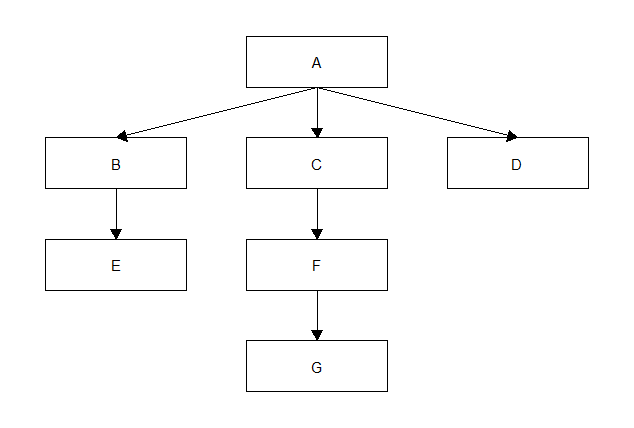

<!-- badges: start -->
  [](https://github.com/nrennie/ggflowchart/actions/workflows/R-CMD-check.yaml)
  [](https://cran.r-project.org/package=ggflowchart)
  <!-- badges: end -->

# {ggflowchart} 

{ggflowchart} is an R package for producing flowcharts using {ggplot2}.

## Installation

Install the package from CRAN using:

```r
install.packages("ggflowchart")
```
or install the development version from GitHub:

```r
remotes::install_github("nrennie/ggflowchart")
```

## Usage

The idea of {ggflowchart} is to create simple flowcharts with minimal effort. Currently, all flowcharts are constructed using the `ggflowchart()` function. For the most basic flowchart, it takes as input a data frame containing (at least) two columns for the start and end points of the edges in the flowchart.

```r
data <- tibble::tibble(from = c("A", "A", "A", "B", "C", "F"),
                       to = c("B", "C", "D", "E", "F", "G"))
```
The flowchart is then created using `ggflowchart()`.

```r
ggflowchart(data)
```



See vignettes for further examples of usage.

## Upcoming features

Note: this package is currently a work-in-progress. Upcoming features that are currently listed as issues being worked on include:

* Changing node outline `colour` based on node attributes.
* Changing `linetype` and `colour` of arrows based on edge attributes.
* Same-level arrows (currently an issue with crossing over).

If you have a suggestion of an additional feature, or find a bug, please file an issue on the [GitHub repository](https://github.com/nrennie/ggflowchart/issues).
